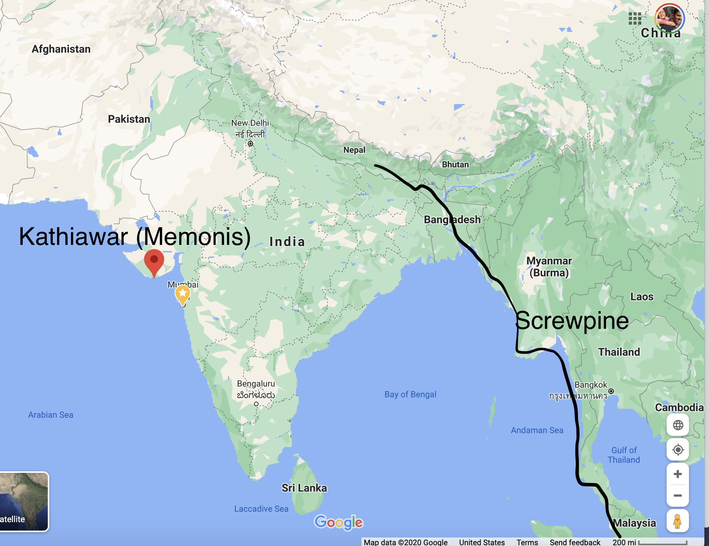

Recently I've been trying out various types of "traditional" biryanis, using spice packets from the Indian grocery store (I've been using Shan spices from Trinethra). Today I made the Memoni biryani. \
Fascinatingly, this biryani uses potatoes, green chillies \*and\* tomatoes - the new world trifecta. Part of the reason I use quotes around "traditional".  But this was not what I found really interesting. The key flavor of the biryani is "screwpine extract" - also known as "pandan". Screwpine doesn't grow anywhere \*near\* Kathiawar, where the Memonis live. So - what gives? Quick guess - the Memonis were traders, and trading by sea they got to Malaysia and got into Pandan flavor while visiting. Pretty amazing.

Of course, I didn't follow the instructions exactly - my family likes the crunchy "tadigh" rice so I dried out the curry and layered the rice on top of a pool of ghee to get the perfect crunch.

(Photo by [Shreyak Singh](https://unsplash.com/@shreyaksingh?utm_source=unsplash&utm_medium=referral&utm_content=creditCopyText) on [Unsplash](https://unsplash.com/s/photos/biryani?utm_source=unsplash&utm_medium=referral&utm_content=creditCopyText))